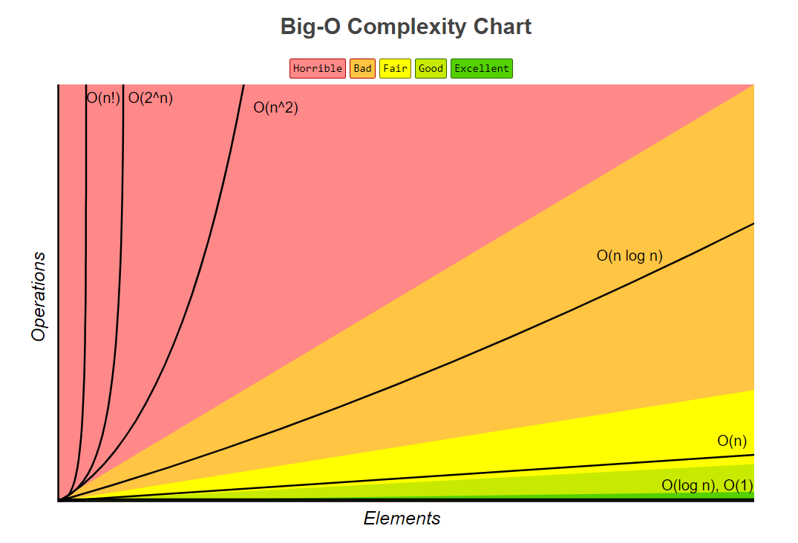
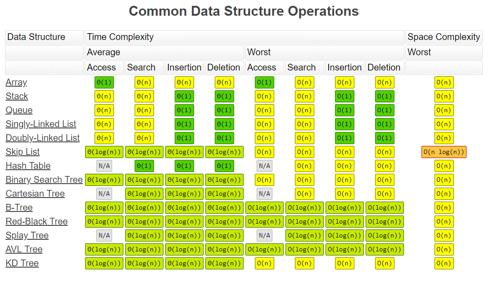
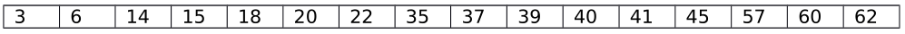

# Review

<!-- TOC -->

- [makefiles](#makefiles)
- [gdb](#gdb)
- [Big O Notation](#big-o-notation)
	- [Common complexities](#common-complexities)
	- [Practice questions](#practice-questions)
- [Linear search](#linear-search)
	- [Practice Questions](#practice-questions)
- [Binary search](#binary-search)
	- [Practice Questions](#practice-questions-1)
	- [Sieve of Eratosthenes](#sieve-of-eratosthenes)
- [Recursion](#recursion)
	- [Sum digits](#sum-digits)
	- [Palindrome](#palindrome)
	- [GCD](#gcd)
	- [Multiplication with the Russian Peasant Algorithm](#multiplication-with-the-russian-peasant-algorithm)
	- [Printing numbers in different bases](#printing-numbers-in-different-bases)
- [Linked lists](#linked-lists)
	- [Linked list operations](#linked-list-operations)
		- [Print linked list](#print-linked-list)
	- [Print and Free linked list](#print-and-free-linked-list)
- [Stacks](#stacks)
	- [Stack operations](#stack-operations)
- [Queues](#queues)
	- [Queue operations](#queue-operations)
	- [Queue practice questions](#queue-practice-questions)

<!-- /TOC -->

- Recursive functions (examples: palindrome, gcd, multiplication with Russian Peasant Algorithm, printing numbers in different bases, linked list length, linked list copy linked list merge lists)
- Arrays
- Abstract Data Types
- Linked Lists, Circular Linked Lists, Doubly Linked Lists
- Stacks and Operations (pop, push, peek, isEmpty, isFull, initialize)
- Queues and Operations (enqueue, dequeue, isEmpty, isFull, initialize)

## makefiles

Helpful resources:

- all in one makefile tutorial <https://gist.github.com/isaacs/62a2d1825d04437c6f08>

- makefile cheat sheet <https://devhints.io/makefile>

Practice problems

**Suppose the following makefile is written. The source code compiles. The command `make prog1` is given. Now assume `util.h` is modified and saved. `make prog1` is executed again.**

```makefile
prog1: prog1.o util.o
	gcc -o prog1 prog1.o util.o
prog1.o: prog1.c util.h
	gcc -c prog1.c
util.o: util.c util.h
	gcc -c util.c
```

**Which command(s) is/are executed?**

1. `gcc -c util.c`
2. `gcc -c prog1.c`
3. `gcc -o prog1 prog1.o util.o`

## gdb

Common gdb commands:

- `info break` list breakpoints

- `break [line number]` set breakpoint at line number

## Big O Notation

Helpful resources

- Awesome big-O website and cheat sheet. <http://bigocheatsheet.com/>

- Helpful explanations and examples of common Big O complexities. <http://cooervo.github.io/Algorithms-DataStructures-BigONotation/big-O-notation.html>

### Common complexities

in order from smallest to largest

- `O(1)`
  - linked list insertion/deletion
  - array access
- `O(log n)`
  - binary search
- `O(n)`
  - single iteration
- `O(n log n)`
  - heapsort
  - merge sort
  - Quick sort
- `O(n^2)`
  - insertion sort
- `O(2^n)`
  - recursion: towers of Hanoi
- `O(n!)`

O(log n)

```c
int i;
for(i=0; i*i < n; i++) {
  //do something in constant time...
}
```

O(n log n)

```c
int i, j;
for (i = 0; i < n; i++) {      // linear loop  O(n) * ...
  for (j = 1; j*j < n; j++) {  // ...log (n)
    // do something in constant time...
  }
}
```





_Graph and chart from <http://bigocheatsheet.com/>_

### Practice questions

**Simplify the following big-O notation expressions.**

1. `O(n^2) + O(n^3) = O(_)`
2. `O(n^2 * lgn) + O(n^2.5) = O(_)`
3. `O(n^2)*O(n^3) = O(_)`
4. `O(2^n) + O(n^7) = O(_)`
5. `n^5 + 100000n^3 + 50n^2 + 2 = O(_)`

**Answers:**

1. `O(n^3)`
2. `O(n^2.5)`
3. `O(n^5)`
4. `O(2^n)`
5. `O(n^5)`

**What are the complexities of the following functions?**

```c
void function1(int n) {
  int i, j, k;
    for(i = 0; i < n; i++) {
      for(j = 0; j < n; j++) {
        for(k = 0; k < j; k++) {
          printf(“Hello\n”);
        }
      }
    }
}

void function2(int n) {
  int i;
    for(i = 0; i * i < n; i++) {
      printf(“I love C.\n”);
    }
  }
}

void function3(int n) {
  int i, j;
    for(i = 0; i < n; i++) {
      for(j = 1; j < n; j = j*2) {
        printf(“Howdy!\n”);
      }
    }
}

void function4(int n) {
  int i;
  for(i = 0; i < 2*n; i++) {
    printf("Hello\n");
  }
}

void function5(int n) {
  int i, j, c;
  for(i = 0; i < n; i++) {
    for(j = 0; j < n; j++) {
      printf("I love complexity. i=%d j=%d total executions=%d\n", i, j, ++c);
    }
  }
}

void function6(int n) {
  int i;
  for(i = 0; i*i <= n; i++) {
    printf("Howdy\n");
  }
}

void function7(int n) {
  int i, j;
  for(i = 0; i < n; i++) {
    for(j = 0; j < i; j++) {
      printf("****\n");
    }
  }
}
```

Answers:

**function1 complexity: `O(n^3)`**

**function2 complexity: `O(sqrt n) or O(n^0.5)`**

**function3 complexity: `O(n log n)`**

**function4 complexity: `O(n)`**

The loop will run 2*n times, and the complexity will remove the constant 2 leaving `O(n)`.

**function5 complexity: `O(n^2)`**

if both i and j are from 0 to n, it's easy to see O(n^2)

```text
O O O O O O O O
O O O O O O O O
O O O O O O O O
O O O O O O O O
O O O O O O O O
O O O O O O O O
O O O O O O O O
O O O O O O O O
```

**function6 complexity: `O(sqrt n)`**

**function7 complexity: `O(n^2)`**

Similar to func2, this comes out to be 1/2 of n^2, which is still O(n^2). This can be visualized like so:

```text
O
O O
O O O
O O O O
O O O O O
O O O O O O
O O O O O O O
O O O O O O O O
```

## Linear search

Linear search is the simple search algorithm you have seen many times before.

big-O complexity: `O(n)`

```c
int linearSearch(int value, int list[], int len) {
	int i;
	if (len <= 0) {
		return -1;
	}
	for (i = 0; i < len; i++) {
		if(list[i] == value) {
			return i;
		}
	}
	return -1;
}
```

### Practice Questions

Assume linear search for the number 41 is performed on the following array.



How many numbers does linear search examine before returning?

****

## Binary search

Binary search works by "dissecting" the list and preforming the search on smaller and smaller sections of the list until there is only 1 item in the list.

big-O complexity: `O(log(n))`

```c
int binarySearch(int value, int list[], int firstIndex, int lastIndex) {
	// base case:
	if (firstIndex >= lastIndex) {
		if (value == list[firstIndex]) {
			return firstIndex;
		} else {
			return -1; // value not found in list
		}
	}

	// recursive cases, looking left or right
	int  middleIndex = (firstIndex + lastIndex) / 2;
	printf("middleIndex: %d\n", middleIndex);

	if (value > list[middleIndex]) {
		return binarySearch(value, list, middleIndex + 1, lastIndex);
	} else {
		return binarySearch(value, list, firstIndex, mid);
	}
}
```

### Practice Questions

You want to find the number 41 in the following sorted array. Using binary search from lecture, what are the recursive calls that are made if the array contains the following integers:


`binarySearch(int firstIndex, int lastIndex);`

**`binarySearch(0, 15);`**

recursive calls:

1. `binarySearch(8, 15);`
2. `binarySearch(8, 11);`
3. `binarySearch(10, 11);`
4. `binarySearch(11, 11);`

Now assume that you want to find the number 6 in the sorted array.

**`binarySearch(0, 15);`**

recursive calls:

1. `binarySearch(0, 7);`
2. `binarySearch(0, 3);`
3. `binarySearch(0, 1);`
4. `binarySearch(1, 1);`

Practice

Finding prime numbers is a common programming situation and can be approached in many different ways.

A simple way which goes through each number up to a given number `max`, is shown below.

```c
for (i = 2; i <= max; i++) { // go through each number
  bool found_prime = true;   // assume we have a prime # to start
  // look for a smaller number that divides i
  for (j = 2; j * j <= i; j++) {
    if (i % j == 0) {
      // found divisor
      found_prime = false;
      break;
    }
  }
  // print it to the screen if prime
  if (found_prime) {
    printf("%d\n", i);
  }
}
```

### Sieve of Eratosthenes

The sieve of Eratosthenes is one of the most efficient ways to find all primes smaller than a given number.

Given an integer n, the algorithm follows the following generic and abstract steps.

1. Generate a list of all integers from 2 (inclusive) to n.

2. Mark each number in the list that is divisible by 2.

3. Mark each number in the list that is divisible by the next number (after 2) that is not already marked.

4. Repeat step 3 until you reach the square root of n.

5. All numbers left in the list are primes.

Once you understand how it works, it may seem hard to implement with code. A simple way is to create an boolean array of length n. Make all the values false, and 'mark' the numbers by setting them to true. At the end the indices of the array that are marked as false are prime numbers.

Here is the Sieve of Eratosthenes algorithm implemented in C.

```c
void sieve(int n) {
  int i, j;
  int len = n + 1;
  bool *list = malloc((len) * sizeof(bool));

  // set all values of list to false
  for (i = 0; i < len; i++) {
    list[i] = false;
  }

  // heart of algorithm
  for (i = 2; i * i <= len; i++) {
    if (!list[i]) { // mark off its multiples in list
      for (j = i; j < len; j++) {
        list[j*i] = true; // mark multiple of i
      }
    }
  }

  // print primes
  for (i = 0; i < len; i++) {
    if(!list[i])
      printf("%d\n", i);
  }
  free(list);
}
```

## Recursion

Recursion is the concept of a function calling itself. Recursion although hard, can be useful and necessary to solve certain problems.

### Sum digits

This problem is part of the review document.

Write a recursive method that sums all of the integers up to and including n.

So for n = 5. Return 1 + 2 + 3 + 5.

```c
int sumDigits(int n) {
  if (n == 0) // base case
    return 0;
  return sumDigits(n - 1) + n; // recursive case
}
```

### Palindrome

A palindrome is a word like 'racecar' that is the same forwards and backwards.

To check if a string is a palindrome we use recursion.

1. Do the first and last character match?

2. If so, do the 2nd and 2nd to last character match?

3. Repeat...

Examine the following recursive function.

```c
int is_palindrome(char *str, int first_index, int last_index) {
  if (first_index >= last_index) {
    /* BASE CASE: string of length 1 or less: return 1 for true */
    return 1;
  } else if (str[first_index] != str[last_index]) {
    /* BASE CASE: first and last chars mismatch: return 0 for false */
    return 0;
  } else {
    /* RECURSIVE CASE: str[first_index] == str[last_index] */
    /* store result in temporary variable so that we can look at it
       in debugger */
    int result = is_palindrome(str, first_index + 1, last_index - 1);
    // update this to be the result of the recursive call
    // should just be one line of code
    return result;
  }
}
```

Another implementation:

```c
int isPalindromeRecursive(char str[], int s, int e) {
  // If there is only one character
  if (s == e)
    return 1;

  // If first and last characters do not match
  if (str[s] != str[e])
    return 0;

  // If there are more than two characters, check if middle substring is also palindrome or not.
  if (s < e + 1)
    return isPalindromeRecursive(str, s + 1, e - 1);

  return 1;
}
```

### GCD

Another problem that can easily solved with recursion is finding the greatest common denominator given two numbers.

Base case: if b equals 0, and found gcd.

Recursive case: call gcd with b, and a % b.

```c
int gcd(int a, int b) {
    if (0 == b)
        return a;
    return gcd(b, a % b);
}
```

More info and explanation here:

<https://www.khanacademy.org/computing/computer-science/cryptography/modarithmetic/a/the-euclidean-algorithm>

### Multiplication with the Russian Peasant Algorithm

Info and explanation of the Russian peasant algorithm - <http://mathforum.org/dr.math/faq/faq.peasant.html>

You can find the product of two numbers simply using the Russian peasant algorithm. The algorithm follows these steps given integers a and b:

1. Double a, and half b. If b is odd drop the remainder.

2. If b is even disregard cross out a and b.

3. Repeat steps 1 and 2 until b is equal to 1.

4. Find the product by adding up all values of a that are not crossed out.

<!-- TODO memorize -->

```c
int peasant(int a, int b) {
  if (b == 1)
    return a;
  if(b % 2 == 0)
    return peasant(a*2, b/2);
  else
    return peasant(a*2, b/2) + a;
}
```

[link to C program](./programs/peasant.c)

### Printing numbers in different bases

A program to print a number in different bases can be implemented simply with recursion.

This function is controlled primarily by `if (base > num)`.

**If** `num` is less than `base`, then we are at the last digit of the number to print, meaning we can represent with on of the characters in the base code.

**Else**, we need to divide the number and print the quotient, and print the remainder.

```c
void printNumInBase(int base, int num) {
  char digits[] = "0123456789ABCDEFGHIJKLMOPQRSTUVWXYZ";
  // if negative print "-" and call printNUm again, but with positive num
  if (num < 0) {
    printf("-");
    printNumInBase(base, -1 * num);
  } else if (base > num) { // base case
    printf("%c", digits[num]);
  } else { // recursive case
    printNumInBase(base, (num / base));
    printNumInBase(base, (num % base));
  }
}
```

[link to C program](./programs/printBases.c)

Recursion is also useful when doing operations on linked lists. These are covered in the linked list section below.

## Linked lists

Helpful resources:

- very helpful and detailed linked list tutorials from Stanford <http://cslibrary.stanford.edu/105/>

Linked lists are made up of data, called nodes, that each point to another node. Forming what is called a **linked list**.

Find more info on linked lists on the [linked list page](./linkedlists.md). On this page we'll be focusing on operations on linked lists and solving problems with linked lists.

### Linked list operations

Assuming the following definitions:

```c
typedef struct nodeTag Node;

/* similar to the textbook -- a Node represents one node in the linked list */
struct nodeTag {
  int num;    // value stored in node
  Node *next; // pointer to next node in list
};
```

#### Print linked list

length, reverse, copy, merge, merge sort, insert, insert head, insert tail

### Print and Free linked list

Iterative:

```c
void printAndFree(Node *top) {
  while (NULL != top) {       // iterate through list
    printf("%d\n", top->num); // print num
    Node *temp = top;         // make temp of top
    top = top->next;          // advance top
    free(temp);               // free top (temp)
  }
}
```

Recursive:

```c
void printAndFreeR(Node * top) {
  // base case list == null
  if (top == NULL) {
    return;
  }
  printf("%d\n", top->num);
  printAndFree(top->next);
  free(top);
}
```

## Stacks

Stacks are a last-in first-out linear list. Meaning that the most recent item pushed onto the stack, will be the next item popped from the stack.

Items are pushed onto the top of the stack. And popped from the top of the stack as well.

### Stack operations

- pop
- push
- peek
- isEmpty
- isFull
- initialize

Practice

Here are some example operations on a stack.

```c
int main(void) {
  Stack s = initStack();
  push(s, 3);
  push(s, 15);
  push(s, 10);
  push(s, 8);
  pop(s);
  // A: What is s’s contents?
  push(s, 12);
  push(s, 2);
  pop(s);
  push(s, 7);
  // B: What is s’s contents?
  pop(s);
  pop(s);
  push(s, 4);
  // C: What is s’s contents?
  freeStack(s);
}
```

A: bottom - 3, 15, 10 - top

B: bottom - 3, 15, 10, 12, 7 - top

C: bottom - 3, 15, 10, 4 - top

## Queues

Different from stacks, queues are last-in first-out. Meaning that the item queued before the other items will be the next item dequeued. Just how a line of people works at the grocery store.

### Queue operations

- enqueue
- dequeue
- isEmpty
- isFull
- initialize

### Queue practice questions

```c
int main(void) {
  Queue q = initQueue();

  enqueue(q, 3);
  enqueue(q, 15);
  enqueue(q, 10);
  enqueue(q, 8);
  dequeue(q);

  // A: What is q’s contents?

  enqueue(q, 12);
  enqueue(q, 2);
  dequeue(q);
  enqueue(q, 7);

  // B: What is q’s contents?

  dequeue(q);
  dequeue(q);
  enqueue(q, 4);

  // C: What is q’s contents?

  freeQueue(q);
}
```

A: front - 15, 10, 8 - back

B: front - 10, 8, 12, 2, 7 - back

C: front - 12, 2, 7, 4 - back
