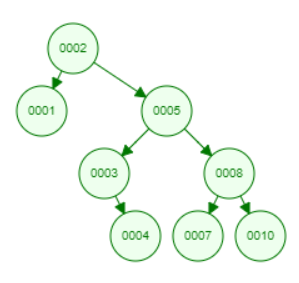

# Exam 3 Review

<!-- @import "[TOC]" {cmd="toc" depthFrom=1 depthTo=6 orderedList=false} -->

<!-- code_chunk_output -->

* [Exam 3 Review](#exam-3-review)
	* [Dictionary](#dictionary)
	* [Trees](#trees)
		* [Traversal](#traversal)
			* [Pre-order](#pre-order)
			* [In-order](#in-order)
			* [Post-order](#post-order)
		* [Tree Terminology](#tree-terminology)
		* [Properties of trees](#properties-of-trees)
		* [Applications of trees](#applications-of-trees)
		* [Recursive functions on trees](#recursive-functions-on-trees)
	* [Binary search trees](#binary-search-trees)
		* [Insertion](#insertion)
	* [Deletion from binary search tree](#deletion-from-binary-search-tree)
		* [Searching binary search tree](#searching-binary-search-tree)
		* [Rotating binary search tree](#rotating-binary-search-tree)
		* [Recursive functions on trees](#recursive-functions-on-trees-1)
	* [Sorting](#sorting)
		* [Selection sort](#selection-sort)
		* [Insertion sort](#insertion-sort)
		* [Quicksort](#quicksort)
		* [Merge sort](#merge-sort)
		* [Complexity of sorting algorithms](#complexity-of-sorting-algorithms)
	* [Review Problems](#review-problems)

<!-- /code_chunk_output -->

* Dictionary ADT
* Trees
  * Traversals (preorder, post order, in order)
  * Terminology, such as parent, child, leaf, root, descendant, ancestor, height
  * Applications of trees
  * Recursive functions on trees
* Binary Search Trees
  * insertion
  * deletion
  * finding items (find a key, find min in tree, find max in tree)
  * rotations (balancing)
  * Recursive functions on trees, such as height and number of nodes
* Sorting
  * Selection sort
  * Insertion sort
  * Quicksort
  * Merge sort
  * Complexity of sorting routines
* Graphs
  * Searches
  * Depth*first search
  * Breadth-first search
  * Terminology, such as vertex, edge, directed, undirected, degree, predecessor, successor, connected, acyclic, weighted
  * Applications of graphs
  * Representations
    * Adjacency Matrix
    * Adjacency List
  * Dijkstra’s algorithm: single source, shortest paths (basis of HW 5)

## Dictionary

Also called a hash map or a map.

## Trees


### Traversal

There are three primary kinds of tree traversals. Which differ in the order in which they visit the nodes in the tree.

1. pre-order
2. in-order
3. post-order

#### Pre-order

Pre-order traversal visits the parent node, left child, and then the right child.


The pre-order traversal for this tree would be: `1 2 4 5 3`

Here is the recursive method for traversing the tree with pre-order.

```c
void preOrder(TreeNode * root) {
    if (root == NULL) return;
    printf("%d ", root->data);
    inOrder(root->left);
    inOrder(root->right);
}
```

#### In-order

In-order traversal visits the left child, the parent, and then the right child.


The in-order traversal for this tree would be: `4 2 5 1 3`

Here is the recursive method for traversing the tree with in-order.

```c
void inOrder(TreeNode * root) {
    if (root == NULL) return;
    inOrder(root->left);
    printf("%d ", root->data);
    inOrder(root->right);
}
```

#### Post-order

Post-order traversal visits the left child, the right child, and then the parent.


The post-order traversal for the above tree is: `4 5 2 3 1`

Here is the recursive method for traversing the tree with post-order.

```c
void postOrder(TreeNode * root) {
    if (root == NULL) return;
    inOrder(root->left);
    inOrder(root->right);
    printf("%d ", root->data);
}
```

### Tree Terminology

The **root** node is the node at the top of the tree.

A **parent** node is a node above other nodes.

A **child** node is a node below another node.

A node with no children is called a **leaf** node.

Nodes which share a parent are called **siblings**.

Height

Level

descendant

ancestor

### Properties of trees

The maximum number of nodes at level `i` in a binary tree is `2^(i - 1)`. Assuming the level of the root is 1.

Maximum number of nodes in a binary tree oh height `h` is `2^h - 1`.

### Applications of trees

1. File system
2. Decision making
3. manipulating data
4. fast searches
5. Binary search trees

### Recursive functions on trees

Functions to traverse trees can be written very simply using recursion which was shown in the traversal sections.

Find the number of nodes in a tree.

```c
int size(TreeNode *t) {
  if (t == NULL) return 0;
  return 1 + size(t->left) + size(t->right);
}
```

Find the number of leaves in a tree.

```c
int countLeaves(Tree * root) {
    if (root == NULL) return 0;
    if (root->left == NULL && root->right == NULL) return 1;

    if (root->left != NULL)
        retrun countLeaves(root->left) + 1;
    if (root->right != NULL)
        return countLeaves(root->right) + 1;
}
```

Find the number of interior nodes with two children in a tree.

```c
int countInterior(Tree * root) {
    if (root == NULL) return 0;
    if (root->left != NULL && root->right != NULL)
        return 1 + countInterior(root->left) + countInterior(root->right);
    else  return countInterior(root->left) + countInterior(root->right);
}
```

finding the height of a tree

level order traversal

## Binary search trees

### Insertion

Insertion into a binary tree is very similar to insertion into a sorted linked list.

First we must find the location to insert the new node into the tree. We can simply use a binary search like recursive algorithm.

We keep searching and going left or right until we find a empty node and we put the new node there.

```c
void insertTree(Node ** treePtr, int key) {
    if (*node == NULL) {
        *node = createNode(key);
    } else if ((*node)->key > key) {
        insert(&(*node)->left, key);
    } else {
        insert(&(*node)->right, key);
    }
}
```

## Deletion from binary search tree

Deleting a node from a binary search tree is not as simple as inserting. Consider deleting a node with two children, where do you put the children?

```c
void deleteFromTree(Node * node, Node ** treePtr) {
    if (*treePtr == NULL) return;
}
```

### Searching binary search tree

  * finding items (find a key, find min in tree, find max in tree)

### Rotating binary search tree

### Recursive functions on trees

    Recursive functions on trees
    such as height and number of nodes

## Sorting

### Selection sort

Big-O: `O(n)`

### Insertion sort

Big-O: ``

### Quicksort

Quicksort uses partitions to recursively sort items bit by bit.

### Merge sort

Merge sort breaks up the list into individual pieces and then _merges_ the items into sorted order.

### Complexity of sorting algorithms

## Graphs

### Terminology

vertex: A node or point on a graph.

edge: A connection between vertices on a graph.

directed: edges are given direction

An **undirected** graph has edges that do not have direction.

The **degree** of a vertex is the number of edges connect to it.

predecessor

successor

A graph is connected if there are no unreachable vertices.

A graph is **acyclic** if it has not loops or cycles.

weighted: edges have weights, also known as cost

adjacent:

### Applications of graphs

### Graph searching

There are two main types of graph searches. Depth first search and breadth first search.

### Depth first search

### Breadth first search

### Representations

### Topological sort

Topological Sorting for a graph is not possible if the graph is not a DAG.

### Dijkstra's algorithm

## Review Problems

**Suppose the following binary search tree is created.**


Show the tree after `7` is inserted.

**Answer:**

```text
      8
   4      9
2    5  7
```

Show the tree after `12` is inserted.

**Answer:**

```text
      8
   4       9
2    5   7   12
```

Show the tree after `3` is inserted.

**Answer:**

```text
      8
   4       9
2    5   7   12
   3
```

**Suppose the following items are inserted into a binary search tree in this order: `2 5 3 8 10 1 4 7`**

**Draw the BST:**



**Suppose the value 3 is deleted from the tree in #2. What does the BST look like after 3 is deleted?**


**Suppose a BST looks like:**


**Rotate the tree to the right, so that 5 is the new root of the tree. What does the tree look like?**

**Answer:**

```text
       5
    2        8
      3   6     9
            7
```

**6. I have a binary tree (not necessarily a binary search tree).**

**When I print the elements using preorder traversal, this is the order:**
`6 4 12 8 7 2 36 94`

**When I print the elements using inorder traversal, this is the order:**
`12 4 8 6 7 36 94 2`

**Draw the binary tree.**

**Answer:**

```text
        6
    4          7
12    8               2
                  36
                      94
```

**7. Assume we have the following BST. Delete the node with value 47. Explain all the steps in the deletion process:**


**Answer:**

To delete the node containing the value 47 we must replace the 47 with the next largest number in the tree. We can get the next largest number of the tree by searching the right subtree of the node for the leftmost node.

This can be done with a simple method:

```c
TreeNode * findSmallestNode(TreeNode * root) {
    if (root->left == NULL) return root;
    else return findSmallestNode(root->left);
}
```

Calling this method and passing in the node containing 76 will return the node containing the value 50. Copy the value 50 into the node containing 47 so that it now contains 50.

Now we need to delete the original node containing the value 50 because we are essentially _moving_ the node. Calling delete on this node simply copies 52 into its data and deletes the 52 node.

**8. Assume a binary tree has the following struct definition:**

```c
typedef struct TreeTag {
int data;
struct TreeTag * left;
struct TreeTag * right;
} Tree;
```

**Write the recursive definition for countLeaves that returns the number of leaves in the tree.**

**Answer:**

```c
int countLeaves(Tree * root) {
    if (root == NULL) return 0;
    if (root->left == NULL && root->right == NULL) return 1

    if (root->left != NULL)
        retrun countLeaves(root->left) + 1;
    if (root->right != NULL)
        return countLeaves(root->right) + 1;
}
```

**18. Assume a list has N items. What is the worst-case complexity of insertion sort?**

**Answer:** `O(n^2)`

**19. Assume a list has N items. What is the worst-case complexity of quicksort?**

**Answer:** `O(n^2)`

**20. What is the worst-case complexity of the insert operation for a binary search tree?**

**Answer:** `O(n)`
