# Final Exam Review

- **Exam 1**
  - C control flow (if, if/else, switch, for, while)
  - Functions (prototypes, definition, parameters, return type)
  - Variables and types (examples: int, char, double, int *, char *, int **, etc.)
  - Arrays
  - Structs
  - Typedef
  - Malloc, free, sizeof (allocating memory on the heap)
  - Pointers (to variables, to structs, to arrays, etc.)
  - NULL, dereferencing pointers, dangling pointers, pointer arithmetic
  - Preprocessor directives
  - Printing to console (stdout)
  - Reading data from keyboard (stdin)
  - File I/O (reading from text files, writing to text files)
  - Identifying when a segmentation would occur
  - Identifying syntax errors
  - Good programming style

- **Exam 2**
  - make and makefiles
  - gdb
  - Complexity and O-notation
  - Linear search
  - Binary search
  - Prime numbers (looking for divisors, sieve of Eratosthenes)
  - Recursive functions (examples: palindrome, gdb, multiply, printing numbers in different bases)
  - Arrays for data storage
  - Linked Lists, Circular Linked Lists, Doubly Linked Lists
  - Stacks
  - Queues

- **Exam 3**
  - Dictionary ADT
  - Trees
    - Traversals (pre-order, post-order, in-order)
    - Terminology, such as parent, child, leaf, root, descendant, ancestor, height
    - Applications of trees
  - Binary Search Trees
    - insertion
    - deletion
  - finding items (find value, find min, find max)
  - Tree Rotations and Balancing
  - Sorting
    - Selection sort
    - Insertion sort
    - Quicksort
    - Merge sort
    - Complexity of sorting routines
  - Graphs
    - Searches
    - Depth-first search
    - Breadth-first search
    - Terminology, such as vertex, edge, directed, undirected, degree, predecessor, successor, connected, acyclic, weighted
    - Applications of graphs
    - Representations
      - Adjacency Matrix
      - Adjacency List
    - Dijkstra’s algorithm: single source, shortest paths (based on HW 6)
    - Topological Sort (posted notes)
    - Minimum Spanning Trees
      - Kruskal
      - Prim (similar to Dijkstra)

- **Since exam 3**
  - MST
    - Kruskal
    - Prim
  - Topological sort
  - Dictionary ADT (reprise)
  - Hash Functions
  - Hash Tables
    - insert, delete, find
    - Collisions with hash tables
  - Open Address Linear Probing
  - Open Address Quadratic Probing
  - Chaining
  - Double Hashing
  - Pros/Cons of open address hashing vs. chaining

## Minimum Spanning Trees

A minimum spanning tree is a subgraph of a graph which contains all the vertices in the graph with the least total cost or weight.

There are two primary algorithms to calculate the minimum spanning tree for a given graph. Prim's and Kruskal's.

### Prim's algorithm

## Example problems

**1. Write C declarations for the following variables:**

    A. An array of 10 integers initialized to 0 called arr.

    B. A pointer to an integer called p1. It should point to slot 6 of arr.

   C. An array than contains 3 pointers to integers, each initialized to null. This should be called arr2.

    D. A pointer-to-pointer to integer which points to slot 1 of arr2. This should be called p2.

```c
  // int array
  int arr[] = {0, 0, 0, 0, 0, 0, 0, 0, 0, 0};

  for (int i = 0; i < 10; i++) {
    printf("%d ", arr[i]);
  }
  printf("\n");

  // int pointer
  int * p1 = &arr[6];

  printf("item at index 6 of arr = %d\n", *p1);

  // array of int pointers
  int * arr2[3];

  // pointer to a int pointer
  int ** p2 = &arr2[1];
```

**2. Consider the linked list code from lab 6. Write a function called deleteAlternates that deletes every other node in the linked list, beginning with the first. It should free each deleted node.**

**If the linked list has items 3, 6, 8, 2, 4, 7, then the function should delete the items 3, 8, and 4. When the function finishes, listPtr should contain a pointer to the Node containing 6.**

```c
void deleteAlternatives(Node ** listPtr) {
  Node *node = *listPtr;
  while (NULL != node->next) {
    node->next = node->next->next;
    Node * temp = node;
    node = node->next;
    free(temp);
  }
}
```

**3. Simplify the following O-notation expressions:**

`O(n^8) + O(n^18) = O(n^18)`

`O(n^3 (log n)^3) + O(n^5) = O(n^5)`

`O(n^3) * O(n^8) = O(n^11)`

`O(23) + O(3^17) = O(1)`

`n^5 + 3n^5 + n^7 + 8152 = O(n^7)`

**4. Consider the definition for a binary tree (not necessarily a binary search tree).**

```c
typedef struct TreeTag Tree;
  struct TreeTag {
    int data;
    Tree *left;
    Tree *right;
};
```

**Write a function called countGreater that counts the number of elements in the tree that are greater than or equal to a given value n. Remember – this is just a binary tree and not necessarily a binary search tree.**

```c
int countGreater(int n) {
  if (NULL == root) return 0;
  int a = 0;
  if (root->value > n) {
    a = 1;
  }
  return countGreater(root->left, n) + countGreater(root->right, n) + a;
}
```

**5. Draw a binary search tree of height 3 that contains the following nodes: 10, 20, 30, 40, 50, 60. This is not necessarily the order in which they are inserted.**

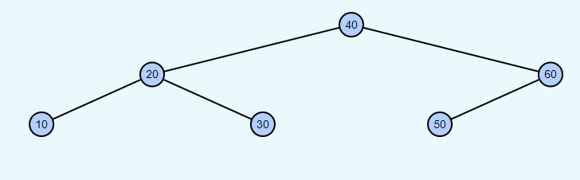

**6. Consider the code below.**

```c
#include <stdio.h>
#include <stddef.h>
#include <stdlib.h>
#include <stdbool.h>

void alpha(int *p) {
  (*p)--;
  printf("%d\n", *p);
}

void check(int *p) {
  printf("%d\n", *p);
  alpha(p);
}

int count(int a) {
  int sq = a*a;
  return sq;
}

int main(void) {
  int n = count(3);
  check(&n);
  printf("%d\n", n);
  return EXIT_SUCCESS;
}
```

**a. What does the code print?**

```text
9
8
8
```

**b. What functions are on the program stack when alpha is executing? (Leftmost is bottom of stack in answers below).**

**Answer:** e. main, check, alpha

**7. Consider the queue.c and queue.h code from lab 7. Recall that this implementation is a circular queue. Assume the MAX_Q is set to 5.**

**Assume the following code is executed:**

```c
Queue q = initQueue();
enqueue(q, 4); // statement 1
enqueue(q, 7); // statement 2
QueueData a = dequeue(q); // statement 3
enqueue(q, 9); // statement 4
enqueue(q, 3); // statement 5
QueueData b = dequeue(q); // statement 6
QueueData c = dequeue(q); // statement 7
enqueue(q, 8); // statement 8
QueueData d = dequeue(q); // statement 9
enqueue(q, 1); // statement 10
```

**A. Show the contents of the queue (both the array, its indices, and contents) after statement 2 has finished.**

queue contents: `8 1`

array:

| index | 0 | 1 | 2 | 3 | 4 |
|-------|---|---|---|---|---|
| value | 8 | 1 | 7 | 9 | 3 |

index of head = 4

**B. What is a?** `4`

**C. Show the contents of the queue after statement 5 has finished.**

queue contents: `7 9 3`

**D. Show the contents of the queue after statement 10 has finished.**

queue contents: `8 1`

**8. I want to sort an array using quicksort. The array has the following values:**

`45 7 28 93 77 -3 18 101`

**This version of quicksort always selects the first element in the array as the pivot element. Consider the contents of the array after the partition step is called, but before recursive calls to quicksort are made. Give three different orderings of this array that could be valid after partition is called:**

Notes on the quicksort algorithm and other sorting algorithms can be found here:

- [Sorting algorithms notes](C\exam3_review.md#sorting)
- [Sorting notes](C\sorting.md)

**Answer:**

valid ordering 1: `-3 7 28 18 45 77 93 101`

valid ordering 2: `7 -3 28 18 45 77 101 93`

valid ordering 3: `7 28 -3 18 45 101 93 77`

**9. Give the worst-case O-notation for each of the following algorithms:**

- **A. mergesort, data is already sorted** `O(n log n)`

- **B. mergesort, data is not already sorted** `O(n log n)`

- **C. quicksort, data is already sorted** `O(n)`

- **D. quicksort, data is not sorted** `O(n log n)`

- **E. binary search tree lookup, tree is balanced** `O(log n)`

- **F. binary search tree lookup, tree is not balanced** `O(n)`

**10. Here is a binary tree:**

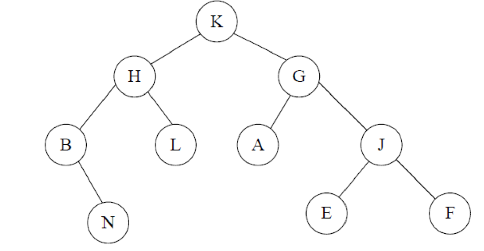

**A. What is the post-order traversal?**

`N B L H A E F J G K`

**B. What is the in-order traversal?**

`B N H L K A G E J F`

**Consider the following BST:**

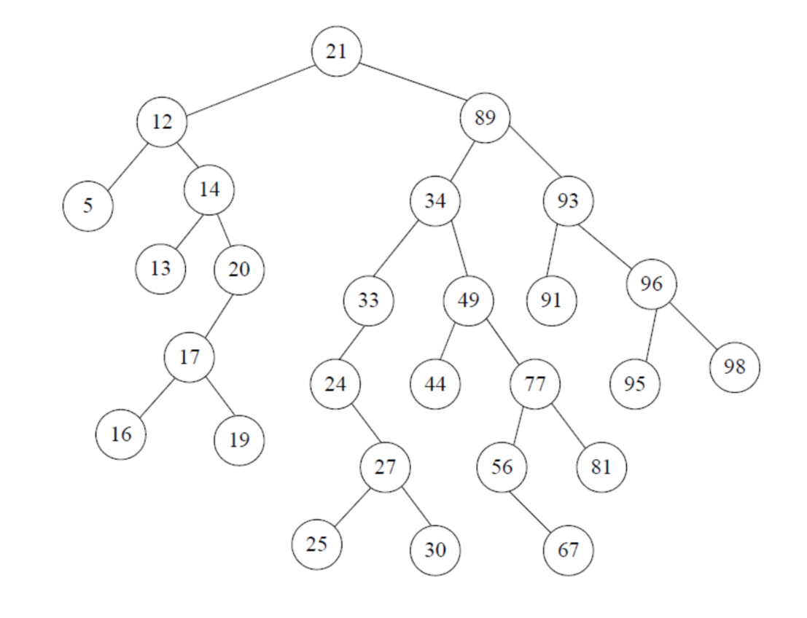

**A. Show the tree after inserting `32`.**

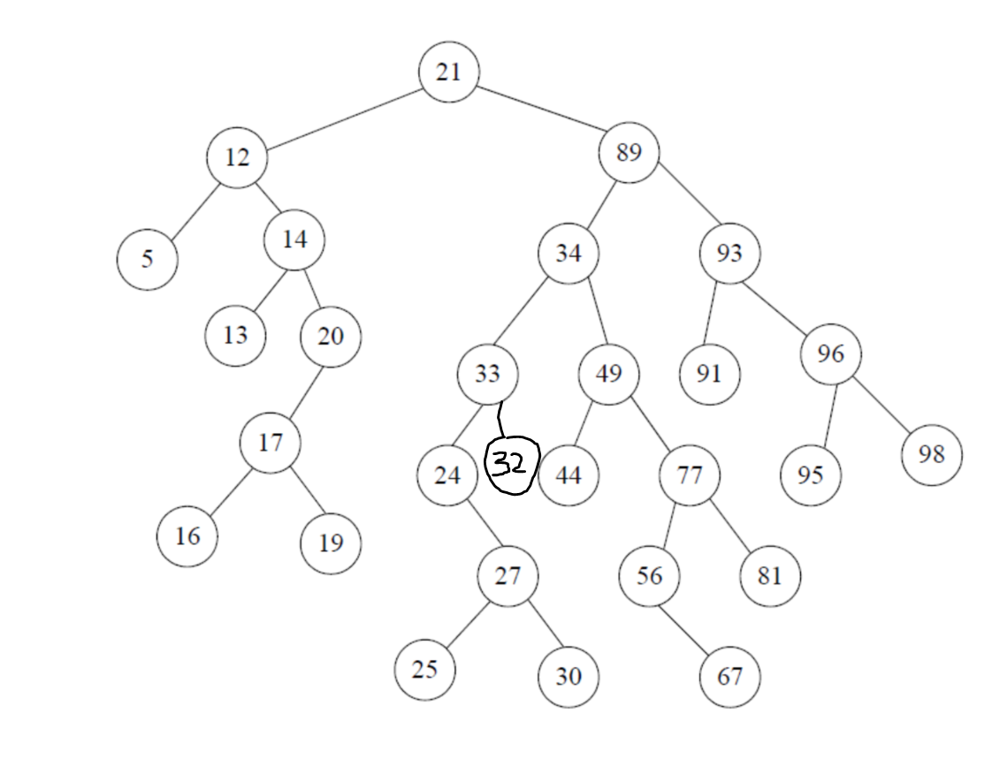

**B. Show the tree after inserting `60`.**

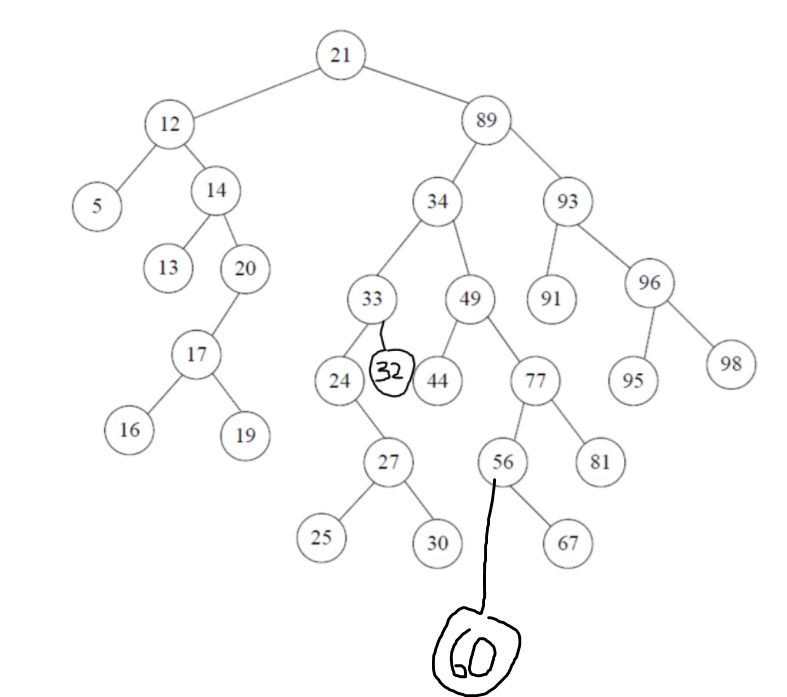

**C. Put *s near each node that is accessed when searching for data item `29`.**

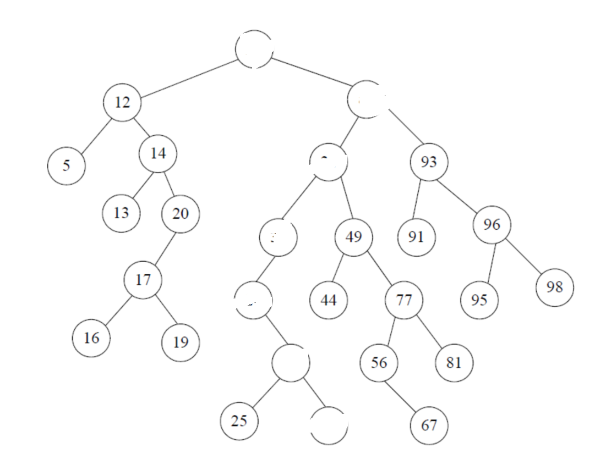

**D. Delete value `21` using the next successor approach. Cross out any values that are updated and cross out edges and nodes that are removed.**

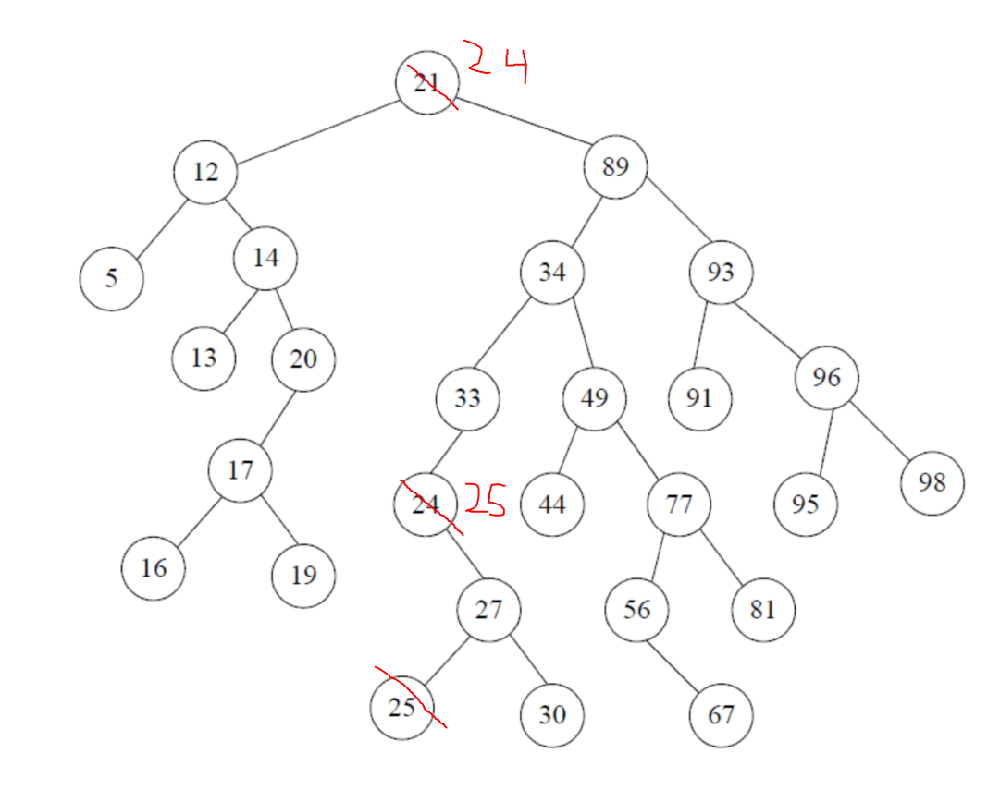

**12. Consider the following graph. Do depth-first traversal of the following graph starting with node A. If there is a choice, select the earliest vertex in alphabetical order. Show the parent, discover/finish times.**

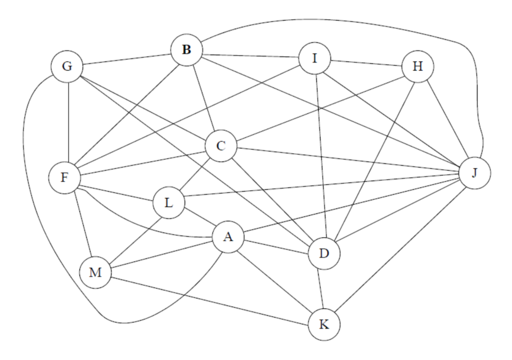

**Answer:**

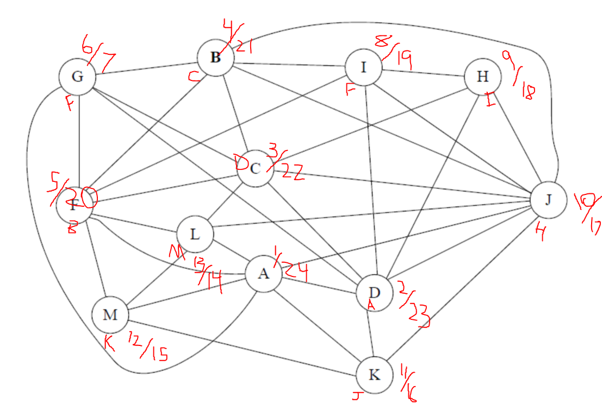

**13. Do breadth-first search on the graph in problem 12. Start with node A. For each node, label the parent and its distance from A.**

**Answer:**

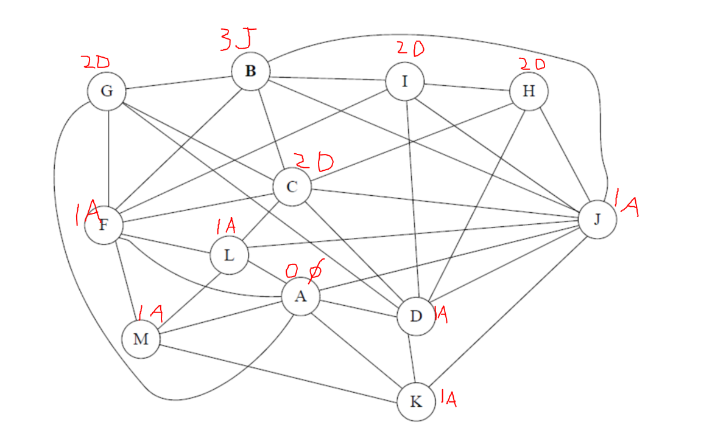

**14. We are about the insert the following elements into an empty 11-slot open-address hash table with linear probing. What does the table look like after all the items have been inserted?**

`Ham (hash value 34)`
`Butter (hash value 28)`
`Jello (hash value 27)`
`Jam (hash value 22)`
`Burger (hash value 11)`
`Salad (hash value 82)`

| null | Burger | Jam | Salad | Ham | null | null | Jello | Butter | null | null |
|---|---|---|---|---|---|---|---|---|---|---|
| 0 | 1 | 2 | 3 | 4 | 5 | 6 | 7 | 8 | 9 | 10 |

**15. Find the minimum spanning tree for the graph below using Kruskal's algorithm. Show the ordering of the edges and determine which edges are added to the MST and which edges are not.**

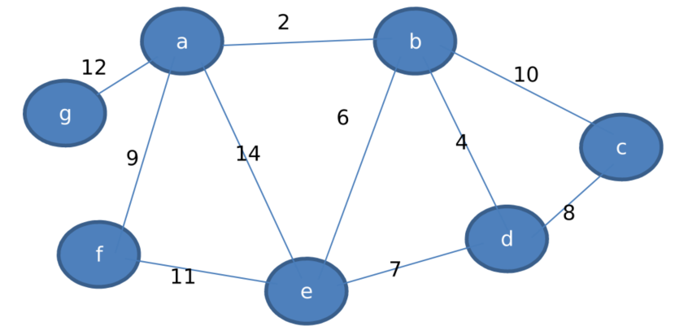

**Answer:**

ordering: `2 4 6 7 8 9 10 11 12`

edges added: `2 4 6 8 9 12`

edges not added: `7 10 11 14`

graph:


**16. Provide a definition of a data structure. An example is not a definition, but may help clarify the definition.**

A data structure is a useful and standardized method of storage for an amount of data. This data structure can be used to store information for calculations, processing, and reference. Different data structures may be superior for certain types of data, and especially for different needs.

For example if you want to represent a map, a graph might be the best choice compared to a list.

**17. It is important to program defensively in C. Consider the following code snippets. Is it safe to execute as-is or should more defenses be added.**

```c
int i = 0;
while (i < 5) {
  printf("%s", label);
  i++;
}
```

**Safe as-is.**

```c
printf("%s", argv[2]);
```

**Not safe.**

```c
if (argc > 2)
  printf("%s", argv[2]);
```
