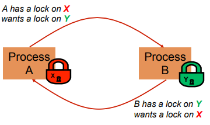

# Exam 2 Review

## Testing

Testing stages:

- During requirements / design review
  - ~60% of bugs can be traced to incomplete requirements specification
- informal developer testing
- unit tests
	- automated tests for all methods
	- regression testing (Travis CI)
	- test-driven development
- code reviews
- formal testing
  - alpha release
- beta release
  - limited user group
- release candidates
- production release
  - bugs exist, cost could be too high to delay release
  - amazon does A/b testing

Test case:

- identifiers
- test item (descriptive title)
- pre-conditions
- input specification (steps to re-create)
- output specification (expected results)
- environmental needs
- special procedural requirements
- inter case dependencies

What inputs to test?

- illegal inputs
- edge cases
- normal inputs

You should not test with random numbers, because it will be hard to tell which number broke the test.

## Threading and Parallelism

Examples:

- speed
- responsive UI
- animations
- operating system
- typing while compiling
- browser tabs

Benefits of using threads:

- responsiveness
- increased performance
- need to do more than one thing **concurrently**

Issues with threads:

- data race
- debugging is super hard

Data race:

same/shared data used by two or more threads

if race winner determines data outcome then we have a race

Using final can prevent data races.

### Creating a thread

The `Runnable` interface is preferred to sub classing `thread`.

```java
implements Runnable

@Override public void run() {
	// stuff for thread to do
}

Thread myThread = new Thread(runnableObject); // create thread
myThread.start(); // run this as a thread
```

### Data races

Data races are not good. They allow the same lines of code to produce different and unpredictable output.

Consider the following identical code snippets.

```java
private Stack<String> stack = new Stack<String>();
public void doSomething() {
	if (stack.isEmpty()) return;
	String s = stack.pop();
 	//do something with s...
}
```

Suppose thread A and thread B want to call `doSomething()` and there is 1 element in `stack`.

1. Thread A tests `stack.isEmpty()` which returns `false`.
2. Thread A pops the element from `stack`.
3. Thread B tests `stack.isEmpty()` which returns `false`.
4. Thread B returns, because there is nothing left to do.

Now consider the same code again.

```java
private Stack<String> stack = new Stack<String>();
public void doSomething() {
	if (stack.isEmpty()) return;
	String s = stack.pop();
 	//do something with s...
}
```

1. Thread A tests `stack.isEmpty()` which returns `false`.
2. Thread B tests `stack.isEmpty()` which returns `false`.
3. Thread A pops the element from `stack`.
4. Thread B pops the stack **Exception!** there are no items on the stack!

See how this could cause problems in even simple programs?

To prevent **data races** we use an idea called **synchronization**.

### Synchronization

An extremely useful tool which must be deployed explicitly.

Think of it like a lock / gate. While some threads might get to the lock, only one is let through at a time.
It's like the lifeguards at a waterpark who make sure the person before you has reached the bottom before you can start sliding.

We can fix the example with synchronization.

```java
private Stack<String> stack = new Stack<String>();
public void doSomething() {
	synchronized(stack) {
		if (stack.isEmpty()) return;
		String s = stack.pop();
 		//do something with s...
	}
}
```

This is called a **synchronized block**. The `stack` object acts as a lock. So, only one thread can own the lock at a time.

We can lock any object including `this`.

```java
public synchronized void doSomthing() {
	...
}
```

is equivalent to

```java
public void doSomething() {
	synchronized(this) {
		...
	}
}
```

### Deadlocking

The downside of locking is **deadlock**.

Deadlock occurs when two or more competing threads are waiting for each other **forever**.

Example

1. thread 1 calls synchronized b inside synchronized a
2. but thread 2 calls synchronized a inside synchronized b
3. thread 1 waits for thread 2... and thread 2 waits for thread 1

Visualization



## Links and resources

- [Cornell presentation on concurrency](https://www.cs.cornell.edu/courses/cs2110/2014fa/L25-ConcurrencyII/cs2110fa14Concurrency2-6up.pdf)
